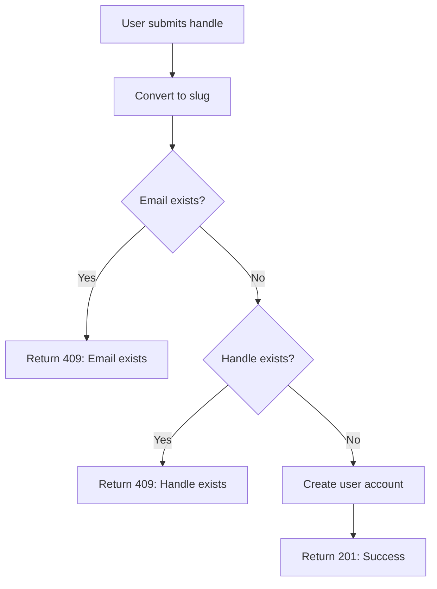

## Overview

Handles are unique, URL-friendly identifiers that serve as the primary way to access user profiles in Dev-Tree. They are automatically converted to slug format and validated for uniqueness across the entire system.

<CardGroup cols={2}>
  <Card title="URL-Friendly" icon="link">
    Handles are converted to lowercase, hyphenated slugs
  </Card>
  <Card title="Unique Constraint" icon="fingerprint">
    Each handle must be unique across all users
  </Card>
  <Card title="Profile Access" icon="globe">
    Access profiles via /:handle endpoint
  </Card>
  <Card title="Real-time Validation" icon="check">
    Check availability before registration
  </Card>
</CardGroup>

## What is a Handle?

A handle is a unique identifier for each user's profile page. Unlike usernames, handles:

- Must be **globally unique** (enforced at database level)
- Are automatically **converted to slug format** (lowercase, hyphenated)
- Serve as the **URL path** to access profiles (`/:handle`)
- Can be **changed** by users (subject to availability)

<Note>
  **Handle vs Username**: While usernames can be duplicated and are for display purposes, handles must be unique and are used in URLs.
</Note>

## Handle Schema Definition

Handles are defined in the User model with strict constraints:

```typescript src/models/User.ts
const userSchema = new Schema({
  handle: {
    type: String,
    required: true,
    trim: true,
    unique: true,  // Ensures uniqueness at database level
  },
  // ... other fields
});
```

<Warning>
  The `unique: true` constraint creates a MongoDB index that prevents duplicate handles at the database level.
</Warning>

## Slug Generation

Handles are automatically converted to URL-safe slugs using the `slug` library:

```typescript
import slug from 'slug';

// Input variations
slug('John Doe')        // 'john-doe'
slug('User@123')        // 'user-123'
slug('Test User!')      // 'test-user'
slug('UPPERCASE')       // 'uppercase'
slug('with spaces')     // 'with-spaces'
```

### How Slug Works

<Accordion title="Lowercase Conversion">
  All characters are converted to lowercase:
  ```typescript
  slug('JohnDoe') // 'johndoe'
  ```
</Accordion>

<Accordion title="Space Replacement">
  Spaces are replaced with hyphens:
  ```typescript
  slug('John Doe') // 'john-doe'
  ```
</Accordion>

<Accordion title="Special Character Removal">
  Special characters are removed or converted:
  ```typescript
  slug('user@123!') // 'user-123'
  ```
</Accordion>

<Accordion title="Multiple Hyphen Reduction">
  Multiple consecutive hyphens are reduced to one:
  ```typescript
  slug('john   doe') // 'john-doe'
  ```
</Accordion>

## Handle Validation During Registration

During user registration, handles are validated for uniqueness before account creation:

```typescript src/controllers/index.ts
export const registerUser = async (req: Request, res: Response) => {
  const slug = (await import("slug")).default;
  const { username, email, password } = req.body;
  
  // Check if email already exists
  const userExists = await User.findOne({ email });
  if (userExists) {
    res.status(409).json({ message: "Email already exists" });
    return;
  }

  // Generate slug and check if handle is available
  const handle = slug(req.body.handle);
  const handleExists = await User.findOne({ handle });
  if (handleExists) {
    res.status(409).json({ message: "Handle already exists" });
    return;
  }

  // Hash password and create user
  const hash = await hashPassword(password);
  await User.create({ username, email, password: hash, handle });

  res.status(201).json({ message: "User created successfully" });
};
```

### Registration Flow



## Real-time Handle Availability Check

The API provides an endpoint to check handle availability before form submission:

```typescript src/controllers/index.ts
export const searchHandle = async (req: Request, res: Response) => {
  try {
    const { handle } = req.body;
    const userExists = await User.findOne({ handle });
    
    if (userExists) {
      const error = new Error(`Handle already exists ${handle}`);
      res.status(409).json({ message: error.message });
      return;
    }
    
    res.status(200).json({ message: "Handle is available" });
  } catch (error) {
    new Error(error);
    res.status(500).json({ message: "Internal server error" });
  }
};
```

### Route Configuration

```typescript src/router.ts
import { body } from "express-validator";
import { searchHandle } from "./controllers";
import { handleInputErrors } from "./middlewares/middleware";

router.post("/search", 
  body("handle").notEmpty().withMessage("Handle is required"),
  handleInputErrors,
  searchHandle
);
```

<Note>
  Use this endpoint to provide real-time feedback to users as they type their desired handle during registration.
</Note>

## Updating Handles

Authenticated users can update their handles, with validation to prevent conflicts:

```typescript src/controllers/index.ts
export const updateUser = async (req: Request, res: Response) => {
  const slug = (await import("slug")).default;
  
  try {
    const { description, links } = req.body;
    const handle = slug(req.body.handle);
    
    // Check if new handle is already taken by another user
    const handleExists = await User.findOne({ handle });
    if (handleExists && handleExists.email !== req.user.email) {
      res.status(409).json({ message: "Handle already exists" });
      return;
    }

    // Update user fields
    req.user.description = description;
    req.user.handle = handle;
    req.user.links = links;
    await req.user.save();
    
    res.status(200).json({ message: "User updated successfully" });
  } catch (error) {
    new Error(error);
    res.status(500).json({ message: "Internal server error" });
  }
};
```

<Warning>
  The update logic allows users to keep their existing handle (comparing by email), but prevents taking handles owned by other users.
</Warning>

## Accessing Profiles by Handle

Handles serve as the primary route parameter for accessing user profiles:

```typescript src/controllers/index.ts
export const getUserByHandle = async (req: Request, res: Response) => {
  try {
    const { handle } = req.params;
    const user = await User.findOne({ handle }).select("-password -email -__v -_id");
    
    if (!user) {
      res.status(404).json({ message: "User not found", success: false, status: 404 });
      return;
    }
    
    res.status(200).json(user);
  } catch (error) {
    new Error(error);
    res.status(500).json({ message: "Internal server error" });
  }
};
```

### Route Definition

```typescript src/router.ts
router.get("/:handle", getUserByHandle);
```

## API Examples

### Check Handle Availability

```bash
curl -X POST https://api.devtree.com/search \
  -H "Content-Type: application/json" \
  -d '{
    "handle": "johndoe"
  }'
```

**Response (Available):**
```json
{
  "message": "Handle is available"
}
```

**Response (Taken):**
```json
{
  "message": "Handle already exists johndoe"
}
```

### Register with Handle

```bash
curl -X POST https://api.devtree.com/auth/register \
  -H "Content-Type: application/json" \
  -d '{
    "handle": "John Doe",
    "username": "John Doe",
    "email": "john@example.com",
    "password": "securepass123"
  }'
```

<Note>
  The handle `"John Doe"` will be automatically converted to `"john-doe"` via slug generation.
</Note>

### Update Handle

```bash
curl -X PATCH https://api.devtree.com/user \
  -H "Authorization: Bearer <token>" \
  -H "Content-Type: application/json" \
  -d '{
    "handle": "new-handle",
    "description": "Updated bio",
    "links": "[]"
  }'
```

### Access Profile

```bash
curl https://api.devtree.com/john-doe
```

## Handle Validation Rules

<CardGroup cols={2}>
  <Card title="Required" icon="asterisk">
    Handle field must be provided during registration
  </Card>
  <Card title="Unique" icon="fingerprint">
    No two users can have the same handle
  </Card>
  <Card title="Trimmed" icon="scissors">
    Whitespace is automatically removed from both ends
  </Card>
  <Card title="Slugified" icon="wand-magic-sparkles">
    Converted to lowercase, URL-safe format
  </Card>
</CardGroup>

## Error Responses

| Status Code | Scenario | Message |
|-------------|----------|----------|
| `409` | Handle already exists | `"Handle already exists"` |
| `404` | User not found by handle | `"User not found"` |
| `400` | Handle field missing | `"Handle is required"` |
| `500` | Database or server error | `"Internal server error"` |

## Best Practices

### For Frontend Developers

1. **Real-time Validation**: Use the `/search` endpoint to check availability as users type
2. **Preview Slugs**: Show users how their input will be converted to a slug
3. **Clear Feedback**: Display availability status with clear visual indicators
4. **Handle Suggestions**: If a handle is taken, suggest alternatives

### Example Frontend Logic

```typescript
async function checkHandleAvailability(handle: string) {
  const response = await fetch('/search', {
    method: 'POST',
    headers: { 'Content-Type': 'application/json' },
    body: JSON.stringify({ handle })
  });
  
  if (response.status === 200) {
    return { available: true, message: 'Handle is available' };
  } else if (response.status === 409) {
    return { available: false, message: 'Handle is already taken' };
  }
}

// Debounced check as user types
const debouncedCheck = debounce(checkHandleAvailability, 500);
```

### For Backend Developers

1. **Always Slugify**: Never store handles without slug conversion
2. **Database Index**: Ensure the unique index is created on the handle field
3. **Case Sensitivity**: MongoDB queries are case-sensitive by default; slugs ensure consistency
4. **Error Messages**: Provide clear, actionable error messages

## Handle vs Email vs Username

| Feature | Handle | Email | Username |
|---------|--------|-------|----------|
| **Uniqueness** | Required | Required | Not required |
| **URL Access** | Yes (`/:handle`) | No | No |
| **Changeable** | Yes | No | Yes |
| **Format** | Slug (lowercase) | Email format | Any string |
| **Public** | Yes | No (excluded) | Yes |
| **Purpose** | Profile identifier | Authentication | Display name |

<Note>
  Handles are the public-facing identifier, while emails are kept private and used only for authentication.
</Note>